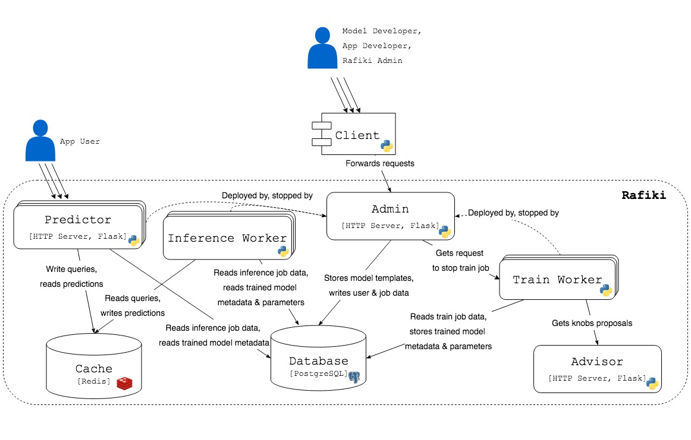
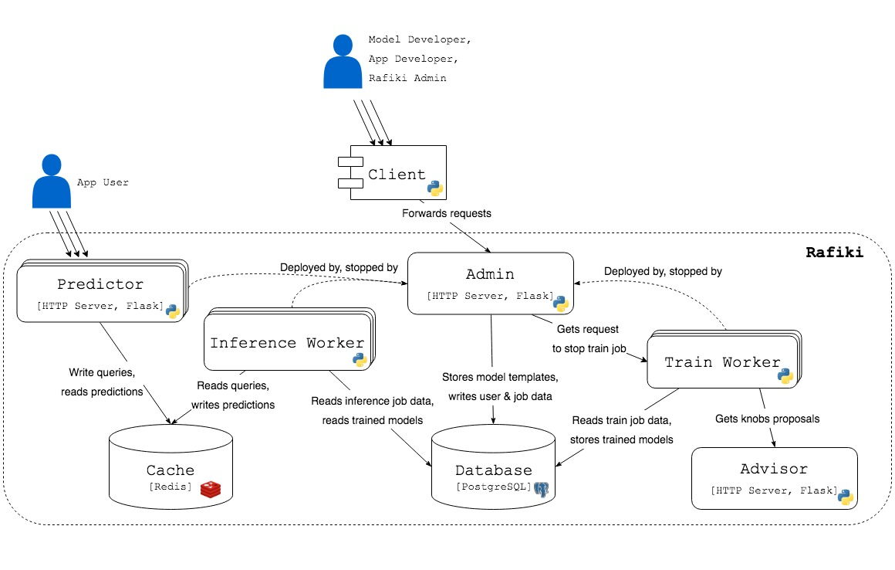

Rafiki's Architecture
====================================================================

.. contents:: Table of Contents

User Roles
--------------------------------------------------------------------

    
    System Context Diagram for Rafiki

There are 4 user roles:

- *Rafiki Admin* manages users
- *Model Developer* manages model templates
- *App Developer* manages train & inference jobs
- *App User* makes queries to deployed models

System Components
--------------------------------------------------------------------

    Container Diagram for Rafiki

Static Components of Rafiki
^^^^^^^^^^^^^^^^^^^^^^^^^^^^^^^^^^^^^^^^^^^^^^^^^^^^^^^^^^^^^^^^^^^^

These components make up Rafiki's static stack.

- *Admin* is a HTTP server that handles requests from users, and accordingly updates Rafiki's database or deploys components (e.g workers, query frontends) based on these requests
- *Client* is a client-side Python SDK for sending requests to Admin
- *Advisor* is a HTTP server that generates proposals of knobs during training
- *Database* is Rafiki's main store for user, train job, inference job, model templates, and trained model data, including model parameters
- *Cache* is Rafiki's temporary store for queries & predictions during inference

Dynamic Components of Rafiki
^^^^^^^^^^^^^^^^^^^^^^^^^^^^^^^^^^^^^^^^^^^^^^^^^^^^^^^^^^^^^^^^^^^^

These components are dynamically deployed or stopped by Admin depending on the statuses of train or inference jobs.

- Each *Train Worker* is a Python program that trains models associated with a train job,
- Each *Inference Worker* is a Python program that makes batch predictions with trained models associated with an inference job
- Each *Query Frontend* is a HTTP server that receives queries from users and responds with predictions, associated with an inference job

