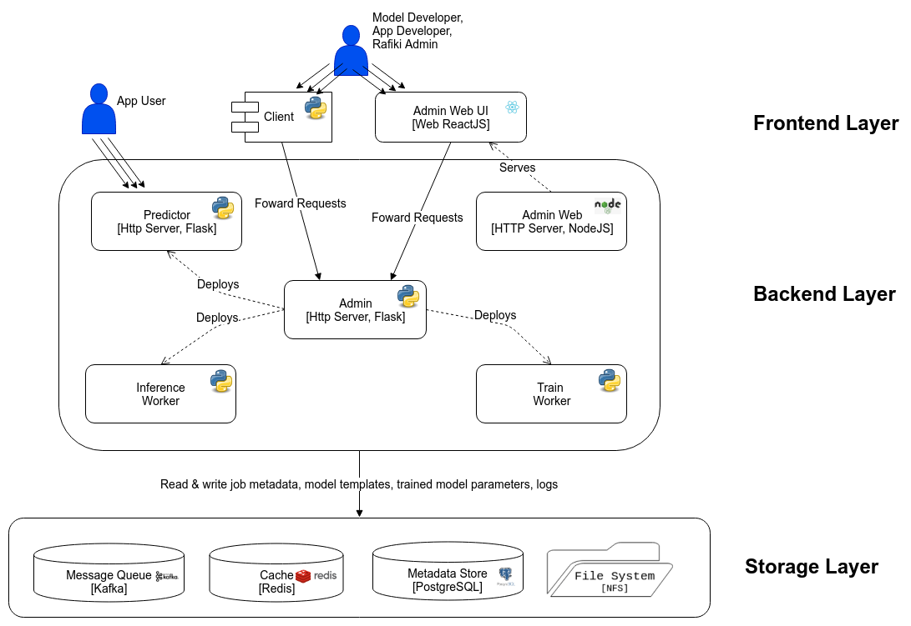

.. _`architecture`:

Rafiki's Architecture
====================================================================

Rafiki’s system architecture consists of 3 static components, 2 central databases, 4 types of dynamic components, and 1 client-side SDK, 
which can be illustrated with a 3-layer architecture diagram.

    Architecture of Rafiki

Static Stack of Rafiki
---------------------------------------------------------------------

Rafiki’s static stack consists of the following:

    *Rafiki Admin* (*Python/Flask*) is the centrepiece of Rafiki. It is a multi-threaded HTTP server which presents a unified REST API over HTTP that fully administrates the Rafiki instance. When users send requests to Rafiki Admin, it handles these requests by accordingly modifying Rafiki’s Metadata Store or deploying/stopping the dynamic components of Rafiki’s stack (i.e. workers for model training & serving).

    *Rafiki Metadata Store* (*PostgreSQL*) is Rafiki’s centralized, persistent database for user metadata, job metadata, worker metadata and model templates. 

    *Rafiki Redis* (*Redis*) is Rafiki’s temporary in-memory store for the implementation of fast asynchronous cross-worker communication, in a way that decouples senders from receivers. It synchronizes the back-and-forth of queries & predictions between multiple Rafiki Inference Workers and a single Rafiki Predictor for an Inference Job.

    *Rafiki Web Admin* (*NodeJS/ExpressJS*) is a HTTP server that serves Rafiki’s web front-end to users, allowing Application Developers to survey their jobs on a friendly web GUI. 

    *Rafiki Client* (*Python*) is Rafiki’s client-side Python SDK to simplify communication with Admin.

Dynamic Stack of Rafiki
---------------------------------------------------------------------

On the other hand, Rafiki’s dynamic stack consists of a dynamic pool of workers. 
Internally within Rafiki’s architecture, Admin adopts master-slave relationships with these workers, managing the deployment and termination of these workers in real-time depending on Train Job and Inference Job requests, as well as the stream of events it receives from its workers. 
When a worker is deployed, it is configured with the identifier for an associated job, and once it starts running, it would first initialize itself by pulling the job’s metadata from Metadata Store before starting on its task.

The types of workers are as follows:

    *Rafiki Advisor Workers* (*Python*) proposes knobs & training configuration for Train Workers. For each model, there is a single Advisor Worker centrally orchestrating tuning of the model together with multiple Train Workers. 

    *Rafiki Train Workers* (*Python*) train models for Train Jobs by conducting Trials. 

    *Rafiki Predictors* (*Python/Flask*) are multi-threaded HTTP servers that receive queries from Application Users and respond with predictions as part of an Inference Job. It does this through  producer-consumer relationships with multiple Rafiki Inference Workers. If necessary, it performs model ensembling on predictions received from different workers.
    
    *Rafiki Inference Workers* (*Python*) serve models for Inference Jobs. In a single Inference Job, there could be multiple Inference Workers concurrently making predictions for a single batch of queries.

Container Orchestration Strategy
---------------------------------------------------------------------

All of Rafiki's components' environment and configuration has been fully specified as a replicable, portable Docker image publicly available as Dockerfiles and on `Rafiki’s own Docker Hub account <https://hub.docker.com/u/rafikiai>`__.

When an instance of Rafiki is deployed on the master node, a `Docker Swarm <https://docs.docker.com/engine/swarm/key-concepts/>`__ is initialized and all of Rafiki's components run within a single `Docker routing-mesh overlay network <https://docs.docker.com/network/overlay/>`__.
Subsequently, Rafiki can be horizontally scaled by adding more worker nodes to the Docker Swarm. Dynamically-deployed workers run as `Docker Swarm Services <https://docs.docker.com/engine/swarm/services/>`__
and are placed in a resource-aware manner.

Distributed File System Strategy
---------------------------------------------------------------------
All components depend on a shared file system across multiple nodes, powered by *Network File System* (*NFS*). 
Each component written in Python continually writes logs to this shared file system.