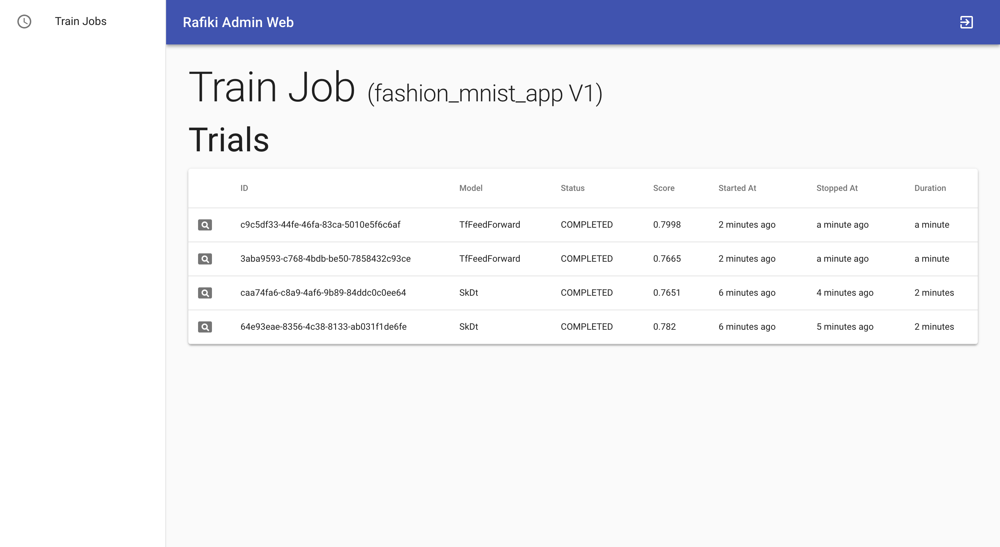

.. _`using-web-admin`:

Using Rafiki's Web Admin
====================================================================

Rafiki Web Admin is accessible at ``<rafiki_host>:<web_admin_port>`` (e.g. ``127.0.0.1:3001`` by default).

Logging In
--------------------------------------------------------------------

Log in with the same credentials for Rafiki Admin.

Viewing Train Jobs
--------------------------------------------------------------------

Currently, you are able to view the statuses of the train jobs you have launched on Rafiki:

    Sample of a Train Job page

For each train job, you can view the statuses of each trial, including the knobs that has been
generated for the trial, its training duration, its score, and plots & messages logged during
model training:

.. figure:: ../images/trial-page.png
    :align: center
    :width: 1200px

    Sample of a Trial page (details section)

.. figure:: ../images/trial-page-plots.png
    :align: center
    :width: 1200px

    Sample of a Trial page (plots section)
